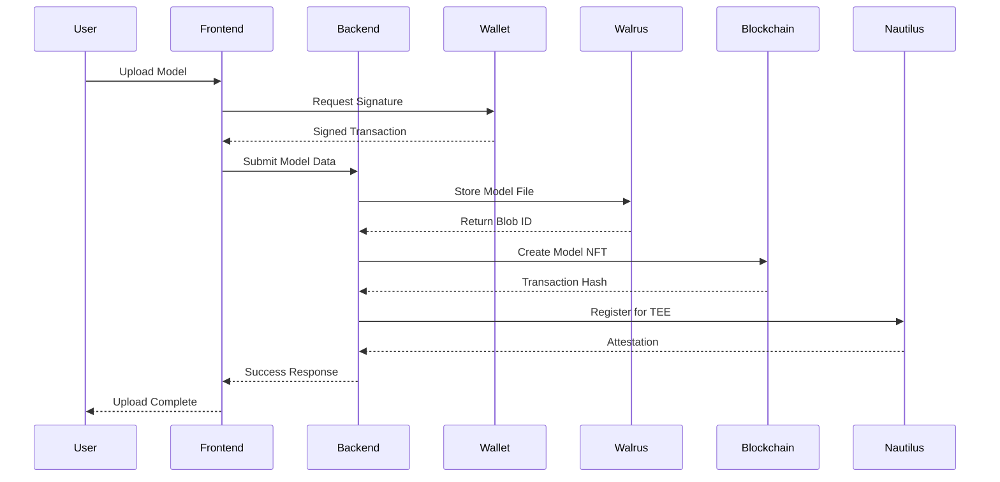
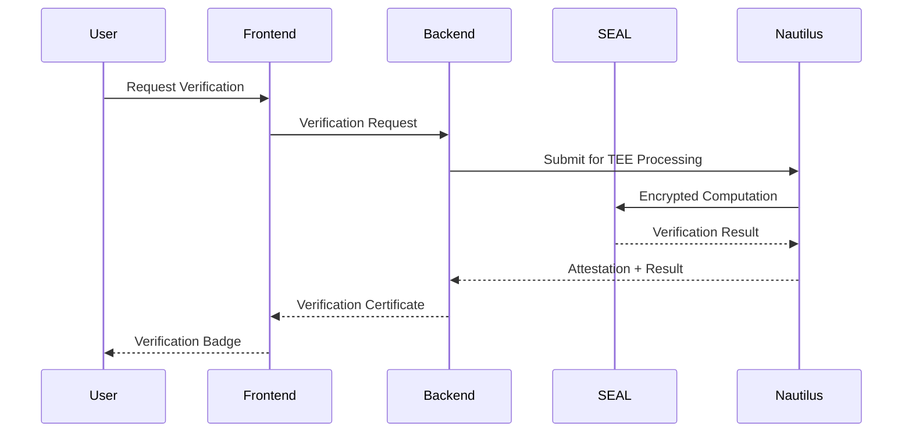

# Satya Marketplace Integration Plan
## Frontend → Backend → Blockchain Architecture

---

## 📋 **Executive Summary**

This document outlines the comprehensive integration plan for connecting the new Next.js frontend with the existing backend infrastructure, including Nautilus TEE, SEAL encryption, Walrus storage, and Sui smart contracts. The goal is to create a fully functional, secure, and scalable data marketplace.

---

## 🏗️ **Current Architecture Analysis**

### **✅ Completed Components:**

#### **1. Frontend (Next.js)**
- **Location**: `/frontend/`
- **Status**: ✅ Fully built and functional
- **Features**:
  - Landing page with hero section
  - Marketplace browsing with categories
  - User dashboard with model management
  - Model upload functionality
  - Model detail pages
  - Responsive design with Tailwind CSS

#### **2. Backend API Server**
- **Location**: `/api/`
- **Status**: ✅ Fully implemented with comprehensive features
- **Features**:
  - Express.js server with TypeScript
  - Sui wallet authentication system
  - Transaction signing infrastructure
  - Rate limiting and security middleware
  - Comprehensive error handling
  - Integration services for all components

#### **3. Nautilus TEE Integration**
- **Location**: `/nautilus/`
- **Status**: ✅ Deployed and functional
- **Features**:
  - AWS Nitro Enclave implementation
  - ML processing in secure environment
  - SEAL integration for encrypted computation
  - Custom ML marketplace application

#### **4. Smart Contracts**
- **Location**: `/accelerator-redac/walrus-repo/contracts/`
- **Status**: ✅ Available (Walrus, SEAL, WAL tokens)
- **Features**:
  - Walrus storage contracts
  - SEAL policy management
  - Token economics (WAL)
  - Staking and governance

---

## 🎯 **Integration Objectives**

### **Primary Goals:**
1. **Seamless User Experience**: Frontend ↔ Backend ↔ Blockchain
2. **Secure Data Flow**: End-to-end encryption with SEAL
3. **Decentralized Storage**: Walrus integration for model storage
4. **Trusted Computation**: Nautilus TEE for secure ML processing
5. **Economic Layer**: Sui smart contracts for payments and governance

### **Technical Goals:**
1. Connect Next.js frontend to existing backend API
2. Integrate Sui wallet authentication in frontend
3. Implement Walrus storage for model files
4. Enable SEAL-encrypted model verification
5. Connect Nautilus TEE for secure computation
6. Deploy and test end-to-end functionality

---

## 📐 **Detailed Integration Plan**

### **Phase 1: Frontend ↔ Backend Connection**

#### **1.1 API Client Integration**
**Objective**: Connect Next.js frontend to existing backend API

**Tasks**:
- [ ] Create API client utilities in frontend
- [ ] Implement environment configuration
- [ ] Add error handling and loading states
- [ ] Set up development proxy for local testing

**Files to Create/Modify**:
```
frontend/
├── src/lib/
│   ├── api-client.ts          # Main API client
│   ├── auth.ts                # Authentication utilities  
│   ├── wallet.ts              # Wallet integration
│   └── constants.ts           # API endpoints & config
├── src/hooks/
│   ├── useAuth.ts             # Authentication hook
│   ├── useWallet.ts           # Wallet connection hook
│   └── useMarketplace.ts      # Marketplace operations
└── .env.local                 # Environment variables
```

#### **1.2 Wallet Authentication Integration**
**Objective**: Implement Sui wallet login in frontend

**Implementation**:
- Sui wallet connection (Sui Wallet, Suiet, etc.)
- Challenge-response authentication flow
- Session management with JWT tokens
- Automatic transaction signing

**User Flow**:
```
1. User clicks "Connect Wallet"
2. Frontend requests challenge from backend
3. User signs challenge with wallet
4. Backend verifies signature → issues session token
5. Frontend stores token for authenticated requests
```

---

### **Phase 2: Walrus Storage Integration**

#### **2.1 Model File Storage**
**Objective**: Store ML models securely on Walrus

**Implementation**:
- Upload models to Walrus through backend API
- Generate Walrus blob IDs for model references
- Store metadata on Sui blockchain
- Implement download/access controls

**Data Flow**:
```
Frontend Upload → Backend Processing → Walrus Storage → Blockchain Metadata
```

#### **2.2 Frontend Integration**
**Tasks**:
- [ ] Modify upload page to use Walrus storage
- [ ] Add file upload progress tracking
- [ ] Implement file type validation
- [ ] Add storage cost estimation

**Files to Modify**:
```
frontend/src/app/upload/page.tsx
frontend/src/components/ui/FormField.tsx
```

---

### **Phase 3: SEAL Encryption Integration**

#### **3.1 Model Verification System**
**Objective**: Enable SEAL-encrypted model verification

**Implementation**:
- Integrate SEAL encryption for sensitive models
- Implement encrypted computation workflows
- Add verification badges/certificates
- Create privacy-preserving analytics

#### **3.2 Frontend Features**
**Tasks**:
- [ ] Add "SEAL Verified" badges to model cards
- [ ] Implement verification request flow
- [ ] Add encryption status indicators
- [ ] Create verification dashboard

---

### **Phase 4: Nautilus TEE Integration**

#### **4.1 Secure Computation**
**Objective**: Connect marketplace to Nautilus enclave

**Implementation**:
- Route computation requests through Nautilus
- Implement attestation verification
- Add secure data sharing workflows
- Enable trusted ML inference

#### **4.2 Frontend Integration**
**Tasks**:
- [ ] Add "Compute in TEE" option for models
- [ ] Implement computation request interface
- [ ] Add attestation verification display
- [ ] Create secure inference dashboard

---

### **Phase 5: Smart Contract Integration**

#### **5.1 Marketplace Contracts**
**Objective**: Deploy and integrate marketplace smart contracts

**Implementation**:
- Deploy marketplace contracts on Sui
- Integrate payment and staking functions
- Implement governance features
- Add economic incentives

#### **5.2 Frontend Integration**
**Tasks**:
- [ ] Implement model purchasing flow
- [ ] Add staking functionality
- [ ] Integrate governance voting
- [ ] Display economic metrics

---

## 🛠️ **Technical Implementation Details**

### **Frontend API Client Architecture**

```typescript
// lib/api-client.ts
export class ApiClient {
  private baseURL: string
  private authToken: string | null
  
  // Authentication
  async connect(walletAddress: string): Promise<AuthSession>
  async getChallenge(address: string): Promise<Challenge>
  async verifySignature(signature: string): Promise<AuthSession>
  
  // Marketplace
  async getModels(filters?: ModelFilters): Promise<Model[]>
  async uploadModel(data: FormData): Promise<UploadResult>
  async purchaseModel(modelId: string): Promise<Transaction>
  
  // Walrus
  async uploadToWalrus(file: File): Promise<WalrusBlob>
  async downloadFromWalrus(blobId: string): Promise<Blob>
  
  // SEAL
  async requestVerification(modelId: string): Promise<VerificationRequest>
  async getVerificationStatus(requestId: string): Promise<VerificationStatus>
  
  // Nautilus
  async submitComputation(request: ComputeRequest): Promise<ComputeJob>
  async getComputationResult(jobId: string): Promise<ComputeResult>
}
```

### **Environment Configuration**

```bash
# frontend/.env.local
NEXT_PUBLIC_API_URL=http://localhost:3001
NEXT_PUBLIC_SUI_NETWORK=testnet
NEXT_PUBLIC_WALRUS_PUBLISHER=https://walrus-testnet-publisher.nodes.guru
NEXT_PUBLIC_NAUTILUS_ENDPOINT=https://your-nautilus-enclave.com
```

### **Backend Configuration**

```bash
# api/.env
SUI_NETWORK=testnet
WALRUS_PUBLISHER_URL=https://walrus-testnet-publisher.nodes.guru
NAUTILUS_ENCLAVE_URL=https://your-nautilus-enclave.com
SEAL_CONFIG_PATH=./src/apps/seal-example/seal_config.yaml
```

---

## 📊 **Data Flow Architecture**

### **Complete User Journey: Model Upload**



### **Model Verification Flow**



---

## 🔐 **Security Considerations**

### **Authentication & Authorization**
- **Wallet-based Authentication**: Cryptographic proof of ownership
- **Session Management**: JWT tokens with expiration
- **Rate Limiting**: Prevent abuse and DoS attacks
- **Input Validation**: Comprehensive data sanitization

### **Data Protection**
- **SEAL Encryption**: Homomorphic encryption for sensitive data
- **TEE Processing**: Secure computation in Nautilus
- **Decentralized Storage**: Walrus for tamper-proof storage
- **Access Controls**: NFT-based ownership verification

### **Transaction Security**
- **User Approval**: All transactions require wallet signature
- **Gas Estimation**: Transparent fee calculation
- **Failed Transaction Handling**: Comprehensive error recovery
- **Audit Trail**: All operations logged and traceable

---

## 📈 **Performance & Scalability**

### **Frontend Optimization**
- **Code Splitting**: Lazy load components
- **Image Optimization**: Next.js Image component
- **Static Generation**: Pre-build static pages
- **CDN Integration**: Fast global content delivery

### **Backend Optimization**
- **Connection Pooling**: Efficient database connections
- **Caching Strategy**: Redis for sessions and rate limits
- **Load Balancing**: Horizontal scaling capability
- **Monitoring**: Comprehensive logging and metrics

### **Blockchain Optimization**
- **Batch Transactions**: Reduce gas costs
- **Event Indexing**: Fast data retrieval
- **Off-chain Metadata**: Store large data off-chain
- **Smart Contract Upgrades**: Proxy patterns for updates

---

## 🧪 **Testing Strategy**

### **Unit Testing**
- **Frontend Components**: React Testing Library
- **API Endpoints**: Jest with Supertest
- **Smart Contracts**: Move testing framework
- **Utilities**: Comprehensive function testing

### **Integration Testing**
- **API Integration**: End-to-end API testing
- **Wallet Integration**: Mock wallet interactions
- **Blockchain Integration**: Testnet deployment testing
- **Storage Integration**: Walrus upload/download tests

### **End-to-End Testing**
- **User Flows**: Complete user journey testing
- **Cross-browser**: Multiple browser compatibility
- **Mobile Testing**: Responsive design validation
- **Performance Testing**: Load and stress testing

---

## 📅 **Implementation Timeline**

### **Week 1: Foundation**
- Set up development environment
- Configure API client and authentication
- Implement basic wallet connection
- Test frontend ↔ backend communication

### **Week 2: Core Features**
- Integrate model upload with Walrus
- Implement model browsing and search
- Add user dashboard functionality
- Deploy to staging environment

### **Week 3: Advanced Features**
- Integrate SEAL verification
- Connect Nautilus TEE processing
- Implement smart contract interactions
- Add comprehensive error handling

### **Week 4: Testing & Deployment**
- Comprehensive testing (unit, integration, e2e)
- Performance optimization
- Security audit
- Production deployment

---

## 🚀 **Deployment Strategy**

### **Development Environment**
```bash
# Frontend (Next.js)
cd frontend
npm run dev  # http://localhost:3000

# Backend (Express)
cd api
npm run dev  # http://localhost:3001

# Local Blockchain
sui start --network testnet
```

### **Staging Environment**
- **Frontend**: Vercel deployment
- **Backend**: Railway/Heroku deployment
- **Database**: PostgreSQL (managed service)
- **Monitoring**: Sentry for error tracking

### **Production Environment**
- **Frontend**: CDN-optimized deployment
- **Backend**: Kubernetes cluster
- **Database**: High-availability setup
- **Monitoring**: Comprehensive observability stack

---

## 🎯 **Success Metrics**

### **Technical Metrics**
- **API Response Time**: < 200ms for most endpoints
- **Frontend Load Time**: < 3 seconds first contentful paint
- **Transaction Success Rate**: > 99% for valid transactions
- **System Uptime**: > 99.9% availability

### **User Experience Metrics**
- **Wallet Connection Success**: > 95% success rate
- **Model Upload Success**: > 98% success rate
- **Search Performance**: < 1 second response time
- **Mobile Responsiveness**: Perfect Lighthouse scores

### **Security Metrics**
- **Zero Security Incidents**: No data breaches
- **Rate Limit Effectiveness**: Block malicious requests
- **Authentication Success**: > 99% valid authentication
- **TEE Attestation**: 100% valid attestations

---

## 🔄 **Maintenance & Updates**

### **Regular Maintenance**
- **Dependency Updates**: Monthly security patches
- **Performance Monitoring**: Continuous optimization
- **User Feedback**: Regular feature improvements
- **Security Audits**: Quarterly security reviews

### **Future Enhancements**
- **Mobile App**: React Native mobile application
- **Advanced Analytics**: ML model performance analytics
- **Social Features**: Model reviews and ratings
- **Enterprise Features**: Organization accounts and bulk operations

---

## 📚 **Documentation & Resources**

### **API Documentation**
- **Comprehensive API docs**: Available at `/docs`
- **Interactive API explorer**: Swagger/OpenAPI
- **SDK/Client libraries**: TypeScript and Python
- **Code examples**: Real-world usage patterns

### **Developer Resources**
- **Setup guides**: Step-by-step development setup
- **Architecture docs**: System design documentation
- **Best practices**: Security and performance guidelines
- **Troubleshooting**: Common issues and solutions

---

## ✅ **Ready for Implementation**

This integration plan provides a comprehensive roadmap for connecting all components of the Satya marketplace. The plan is designed to be executed incrementally, ensuring each phase builds upon the previous one while maintaining system stability and user experience.

**Next Steps**:
1. Review and approve this integration plan
2. Set up development environment
3. Begin Phase 1: Frontend ↔ Backend Connection
4. Regular progress reviews and plan adjustments

The foundation is solid, the architecture is well-designed, and all necessary components are available. We're ready to build the future of secure, decentralized data marketplaces! 🚀